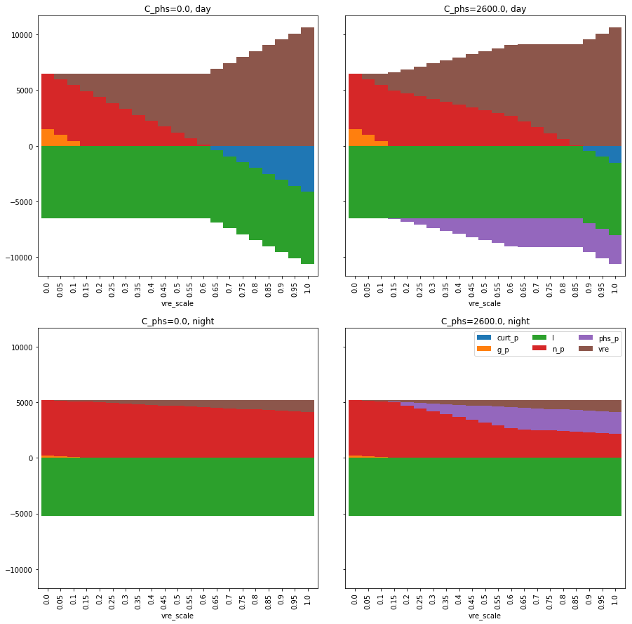
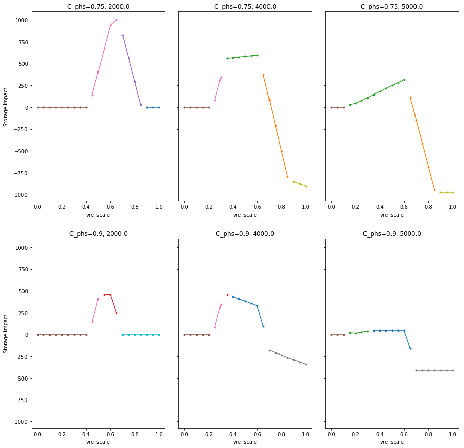

Example 1: Two plants, constant supply curves
=============================================

--------------

This illustrates storage impact in a 2 power plant/2 time slot system
with constant supply curves.

.. code:: ipython3

    import numpy as np
    import pandas as pd
    import matplotlib.pyplot as plt
    
    import symenergy.core.model as model
    import symenergy.evaluator.evaluator as evaluator
    
    pd.options.mode.chained_assignment = None

Initialize model
----------------

The model structure is initialized.

Parameter values are insignificant at this stage as long as they are
!=None. They represent default values and define the model structure.

``Model.generate_solve()`` loads the solved model results from the
corresponding pickle file if a model with the same structure (variables
and multipliers) has been solved before.

``nthread`` is the number of cores used for parallelized solving.

.. code:: ipython3

    m = model.Model(curtailment=True, nthreads=7)
    
    m.add_slot(name='day', load=4.5, vre=3)
    m.add_slot(name='night', load=5, vre=0.5)
    
    m.add_plant(name='n', vc0=1, vc1=None, slots=m.slots, capacity=3, fcom=10, cap_ret=True)
    m.add_plant(name='g', vc0=2, vc1=None, slots=m.slots)
    
    m.add_storage(name='phs', eff=0.75, slots=m.slots,
                  capacity=0.5, energy_capacity=1,
                  slots_map={'day': 'chg', 'night': 'dch'})
    
    m.generate_solve()

.. parsed-literal::

    Loading from pickle file /mnt/data/Dropbox/SHARED_REPOS/symenergy/cache/C04F76D522DF.pickle.

Initialize evaluator instance, set model parameters and parameter sweep values.
-------------------------------------------------------------------------------

The model results are evaluated for all combinations of the iterables’
values in the ``x_vals`` argument.

The ``Evaluator.df_x_vals`` instance attribute is modified after
initialization to \* filter model runs \* set the storage energy
capacity ``E_phs`` in dependence on the efficiency ``eff_phs`` (i.e. the
storage type)

.. code:: ipython3

    m.comps['n'].vc0.value = 10
    m.comps['n'].fcom.value = 9
    m.comps['n'].C.value = 3500
    
    m.comps['g'].vc0.value = 90
    
    m.slots['day'].l.value = 6500
    m.slots['night'].l.value = 5200
    
    vre_day = 1
    vre_night = 0.1
    tot_l = m.slots['day'].l.value + m.slots['night'].l.value
    
    m.slots['day'].vre.value = vre_day / (vre_day + vre_night) * tot_l
    m.slots['night'].vre.value = vre_night / (vre_day + vre_night) * tot_l
    
    m.storages['phs'].eff.value = 0.75
    m.storages['phs'].C.value = 1
    m.storages['phs'].E.value = 1
    
    dd_75 = 14
    dd_90 = 4
    
    phs_C_max = m.slots['day'].l.value * 0.5
    
    x_vals_vre = {m.vre_scale: np.linspace(0, 1, 21),
                  m.comps['phs'].C: [0, 2600],
                  m.comps['phs'].E: [None], # <-- set later
                  m.comps['phs'].eff: [0.75, 0.9],
                  m.comps['n'].C: [2000, 4000, 5000],
                  }
    
    ev = evaluator.Evaluator(m, x_vals_vre, drop_non_optimum=False)
    
    ev.df_x_vals['E_phs'] = ev.df_x_vals.C_phs
    ev.df_x_vals.loc[ev.df_x_vals.eff_phs == 0.90, 'E_phs'] *= dd_90/12
    ev.df_x_vals.loc[ev.df_x_vals.eff_phs == 0.75, 'E_phs'] *= dd_75/12
    
    mask_vre = (ev.df_x_vals.vre_scale.isin(np.linspace(0, 1, 11))
                | ev.df_x_vals.vre_scale.isin(np.linspace(0.55, 0.75, 21)))
    mask_phs = (ev.df_x_vals.C_phs.isin(np.linspace(0, phs_C_max, 6)))
    
    ev.df_x_vals = ev.df_x_vals.loc[mask_vre | mask_phs]
    
    print(ev.df_x_vals.head(10))
    print('Length: ', len(ev.df_x_vals))

.. parsed-literal::

       vre_scale  C_phs        E_phs  eff_phs   C_n
    0        0.0      0     0.000000     0.75  2000
    1        0.0      0     0.000000     0.75  4000
    2        0.0      0     0.000000     0.75  5000
    3        0.0      0     0.000000     0.90  2000
    4        0.0      0     0.000000     0.90  4000
    5        0.0      0     0.000000     0.90  5000
    6        0.0   2600  3033.333333     0.75  2000
    7        0.0   2600  3033.333333     0.75  4000
    8        0.0   2600  3033.333333     0.75  5000
    9        0.0   2600   866.666667     0.90  2000
    Length:  252

Generate functions from the symenergy results
---------------------------------------------

This evaluates the results using the fixed parameters and returns
functions with arguments corresponding to the columns in the
``Evaluator.df_x_vals`` table

.. code:: ipython3

    ev.get_evaluated_lambdas(skip_multipliers=True)

.. parsed-literal::

    Extracting solution for n_C_ret_None...substituting...lambdify...done.
    Extracting solution for n_p_day...substituting...lambdify...done.
    Extracting solution for n_p_night...substituting...lambdify...done.
    Extracting solution for g_p_day...substituting...lambdify...done.
    Extracting solution for g_p_night...substituting...lambdify...done.
    Extracting solution for phs_e_None...substituting...lambdify...done.
    Extracting solution for phs_p_day...substituting...lambdify...done.
    Extracting solution for phs_p_night...substituting...lambdify...done.
    Extracting solution for curt_p_day...substituting...lambdify...done.
    Extracting solution for curt_p_night...substituting...lambdify...done.
    Extracting solution for pi_load_day...substituting...lambdify...done.
    Extracting solution for pi_load_night...substituting...lambdify...done.
    Extracting solution for tc...substituting...lambdify...done.

Evaluate results for all entries of the ``Evaluator.df_x_vals table``
---------------------------------------------------------------------

**Note: Depending on the size of the model and the ``df_x_vals`` table
this takes a while.**

.. code:: ipython3

    ev.expand_to_x_vals(verbose=False)

Add additional columns to the ``Evaluator.df_exp`` table
--------------------------------------------------------

Variables are not indexed by time slot names. The
``Evaluator.map_func_to_slot`` method expands the ``Evaluator.df_exp``
table by additional columns with variable names and time slots names.

.. code:: ipython3

    ev.map_func_to_slot()

.. parsed-literal::

    map_func_to_slot

Build supply table ``Evaluator.df_bal``
---------------------------------------

This includes the demand to the result demand and adjusts the signs,
such that demand, charging, and curtailment are negative.

.. code:: ipython3

    ev.build_supply_table()
    
    print(ev.df_bal.head(5))

.. parsed-literal::

             C_n  C_phs  E_phs                                         const_comb  \
    1196  2000.0    0.0    0.0  act_lb_n_pos_p_day=0, act_lb_n_pos_p_night=0, ...   
    1197  2000.0    0.0    0.0  act_lb_n_pos_p_day=0, act_lb_n_pos_p_night=0, ...   
    1198  2000.0    0.0    0.0  act_lb_n_pos_p_day=0, act_lb_n_pos_p_night=0, ...   
    1199  2000.0    0.0    0.0  act_lb_n_pos_p_day=0, act_lb_n_pos_p_night=0, ...   
    1200  2000.0    0.0    0.0  act_lb_n_pos_p_day=0, act_lb_n_pos_p_night=0, ...   
    
          eff_phs                   func func_no_slot   lambd    slot  vre_scale  
    1196     0.75  n_C_ret_None_lam_plot      n_C_ret     0.0  global        0.0  
    1197     0.75       n_p_day_lam_plot          n_p  2000.0     day        0.0  
    1198     0.75     n_p_night_lam_plot          n_p  2000.0   night        0.0  
    1199     0.75       g_p_day_lam_plot          g_p  4500.0     day        0.0  
    1200     0.75     g_p_night_lam_plot          g_p  3200.0   night        0.0  

Simple energy balance plot with and without storage for day and night
---------------------------------------------------------------------

.. code:: ipython3

    df = ev.df_bal
    df = df.loc[-df.func_no_slot.str.contains('tc', 'lam')
               & df.eff_phs.isin([0.75])
               & df.C_n.isin([5000])
               & -df.slot.isin(['global'])]
    
    df['lambd'] = df.lambd.astype(float)
    df['vre_scale'] = df.vre_scale.apply(lambda x: round(x*10000)/10000)
    
    
    dfpv = df.pivot_table(columns='func_no_slot', values='lambd', index=['C_phs', 'slot', 'vre_scale'])
    
    list_slot = dfpv.index.get_level_values('slot').unique()
    list_c_phs = dfpv.index.get_level_values('C_phs').unique()
    
    fig, axarr = plt.subplots(len(list_c_phs),
                              len(list_slot), sharey=True, gridspec_kw={'wspace': 0.1,}, figsize=(15,15))
    
    for nslot, slot in enumerate(list_slot):
        for nc_phs, c_phs in enumerate(list_c_phs):
    
            ax = axarr[nslot][nc_phs]
            dfpv.loc[(c_phs, slot)].plot.bar(ax=ax, legend=False, use_index=True, stacked=True, width=1)
            
            ax.set_title('C_phs=%s, %s'%(c_phs, slot))
    
            
    leg = ax.legend(ncol=3)        
    

Impact of storage on baseload production by constraint combination
------------------------------------------------------------------

.. code:: ipython3

    df = ev.df_exp
    df = df.loc[df.func.str.contains('n_p_')
               & df.is_optimum.isin([True])
               & -df.slot.isin(['global'])]
    
    df.head(5)
    
    dfdiff = df.pivot_table(index=[x for x in ev.x_name if not x in ['E_phs', 'C_phs']] + ['func'],
                            values='lambd', columns='C_phs')
    dfdiff['diff'] = dfdiff[2600] - dfdiff[0]
    
    dfcc = df.loc[df.C_phs == 2600].set_index(dfdiff.index.names)['const_comb']
    dfdiff = dfdiff.reset_index().join(dfcc, on=dfdiff.index.names)
    
    dfpv = dfdiff.pivot_table(index=['eff_phs', 'C_n', 'vre_scale'], columns='const_comb', values='diff')
    
    list_eff = dfpv.index.get_level_values('eff_phs').unique()
    list_c_n = dfpv.index.get_level_values('C_n').unique()
    
    fig, axarr = plt.subplots(len(list_eff),
                              len(list_c_n), sharey=True, gridspec_kw={'wspace': 0.1,}, figsize=(15,15))
    
    for neff, eff in enumerate(list_eff):
        for nc_n, c_n in enumerate(list_c_n):
    
            ax = axarr[neff][nc_n] if isinstance(axarr, np.ndarray) else axarr
            dfpv.loc[(eff, c_n)].plot(ax=ax, legend=False, marker='.',use_index=True, stacked=False, width=1)
            
            ax.set_title('C_phs=%s, %s'%(eff, c_n))
            ax.set_ylabel('Storage impact')

