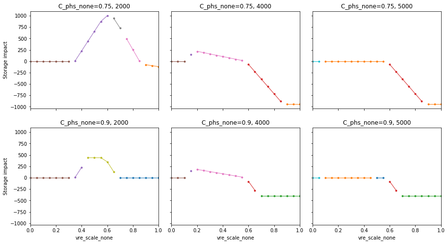

=============================================
Example 1: Two plants, constant supply curves
=============================================

This example shows the application of SymEnergy to a system with

* two time slots
* two power plants
* storage capacity

Power plant cost supply curves are constant. A similar example was discussed in detail in `<https://doi.org/10.1016/j.eneco.2019.104495>`_

On the technical side, this example demonstrates the adjustment of model parameters at various stages.

Jupyter Notebook available on github: `<https://github.com/mcsoini/symenergy/blob/master/examples/example_constant.ipynb>`_

.. code:: ipython3

    from symenergy import logger
    logger.setLevel('ERROR')
    import symenergy.core.model as model

Model initialization
====================

* The model structure is initialized. See the documentation section :ref:`sect_comps` for further details on their parameters and initialization.
* Parameter *values* (``load``, ``vre``, ``vc0``, ``capacity`` etc.) are insignificant at this stage as long as they are ``!=None``. They represent default values and define the model structure.
* `m.generate_solve()`` loads the solved model results from the corresponding pickle file if a model with the same structure (variables and multipliers) was solved earlier. The method call ``m.cache.delete()`` would delete this file and forces the model to re-solve.
* ``nthread`` is the number of cores used for parallelized solving using Python's multiprocessing.
* ``curtailment=True`` adds curtailment variables to each of the model's time slots.
* Storage operation is limited to day-time charging and night-time discharging, as defined by the ``slots_map`` parameter (see :ref:`label_theory_components_storage`).

.. code:: ipython3

    m = model.Model(curtailment=True, slot_weight=12)
    
    m.add_slot(name='day', load=5000, vre=8500)
    m.add_slot(name='night', load=4500, vre=850)
    m.add_plant(name='n', vc0=10, capacity=3500, fcom=9, cap_ret=True)
    m.add_plant(name='g', vc0=90)
    m.add_storage(name='phs', eff=0.75, capacity=1, energy_capacity=1, slots_map={'chg': ['day'] , 'dch': ['night']})
    
    #m.cache.delete()
    m.generate_solve()

Example results
---------------

The model attribute `m.df_comb` is a DataFrame containing all mathematically feasible solutions of the optimization problem. It is indexed by the constraint combinations (columns `act_...` and `idx`).

For any existing index ``idx`` we can print the results for each variable using the convenience function ``m.print_results``:

.. code:: ipython3

    m.print_results(218)

.. parsed-literal::

    ******************** curt_p_day ********************
    0
    ******************** curt_p_night ********************
    0
    ******************** g_p_day ********************
    0
    ******************** g_p_night ********************
    eff_phs_none**1.0*(l_day - vre_day*vre_scale_none) + l_night - vre_night*vre_scale_none
    ******************** lb_curt_pos_p_day ********************
    eff_phs_none**0.5*w_none*(ec_phs_none - eff_phs_none**0.5*vc0_g_none)
    ******************** lb_curt_pos_p_night ********************
    -vc0_g_none*w_none
    ******************** lb_g_pos_p_day ********************
    w_none*(-ec_phs_none*eff_phs_none**0.5 + eff_phs_none**1.0*vc0_g_none - vc0_g_none)
    ******************** lb_n_pos_C_ret_none ********************
    fcom_n_none
    ******************** lb_n_pos_p_day ********************
    w_none*(-ec_phs_none*eff_phs_none**0.5 + eff_phs_none**1.0*vc0_g_none - vc0_n_none)
    ******************** lb_n_pos_p_night ********************
    w_none*(vc0_g_none - vc0_n_none)
    ******************** n_C_ret_none ********************
    0
    ******************** n_p_day ********************
    0
    ******************** n_p_night ********************
    0
    ******************** phs_e_none ********************
    eff_phs_none**0.5*w_none*(-l_day + vre_day*vre_scale_none)
    ******************** phs_pchg_day ********************
    -l_day + vre_day*vre_scale_none
    ******************** phs_pdch_night ********************
    eff_phs_none**1.0*(-l_day + vre_day*vre_scale_none)
    ******************** pi_phs_pwrerg_chg_none ********************
    ec_phs_none - eff_phs_none**0.5*vc0_g_none
    ******************** pi_phs_pwrerg_dch_none ********************
    eff_phs_none**0.5*vc0_g_none
    ******************** pi_supply_day ********************
    eff_phs_none**0.5*(-ec_phs_none + eff_phs_none**0.5*vc0_g_none)
    ******************** pi_supply_night ********************
    vc0_g_none

This constraint combination corresponds the combination of active and inactive constraints shown below:

* The power output from the plant *n* is zero (``act_lb_n_pos_p_day == True``, ``act_lb_n_pos_p_night == True``)
* The capacity retirement of *n* is zero (``act_lb_n_pos_C_ret_none == True``)
* Consequently, none of the *n* capacity constraints are binding.
* Day-time power production from *g* us zero (``act_lb_g_pos_p_day == True``)
* Storage operation is non-zero (``act_lb_phs_pos_... == False``) and not capacity-constrained (``act_lb_phs_..._cap_... == False``)
* Curtailment is zero during both time slots (``act_lb_curt_pos_p_... == True``)

.. code:: ipython3

    display(m.df_comb.set_index('idx').loc[218, m.constrs_cols_neq].T)

.. parsed-literal::

    act_lb_n_pos_p_day              True
    act_lb_n_pos_p_night            True
    act_lb_n_pos_C_ret_none         True
    act_lb_n_p_cap_C_day           False
    act_lb_n_p_cap_C_night         False
    act_lb_n_C_ret_cap_C_none      False
    act_lb_g_pos_p_day              True
    act_lb_g_pos_p_night           False
    act_lb_phs_pos_pchg_day        False
    act_lb_phs_pos_e_none          False
    act_lb_phs_pos_pdch_night      False
    act_lb_phs_pchg_cap_C_day      False
    act_lb_phs_pdch_cap_C_night    False
    act_lb_phs_e_cap_E_none        False
    act_lb_curt_pos_p_day           True
    act_lb_curt_pos_p_night         True
    Name: 218, dtype: object

All model parameters are gathered in the ``m.parameters`` collection. Their attributes can be accessed by calling the ``Parameters`` instance.

.. code:: ipython3

    m.parameters(('name', 'value'))

.. parsed-literal::

    [('vc0_n_none', 10),
     ('fcom_n_none', 9),
     ('C_n_none', 3500),
     ('vc0_g_none', 90),
     ('l_day', 5000),
     ('vre_day', 8500),
     ('w_none', 12),
     ('l_night', 4500),
     ('vre_night', 850),
     ('ec_phs_none', 1e-12),
     ('eff_phs_none', 0.75),
     ('C_phs_none', 1),
     ('E_phs_none', 1),
     ('vre_scale_none', 1)]

Similarly, constraints and their expressions are stored in instances of the ``Variables`` class (of the model and the components). For example, the storage's inequality constraint names, multiplier symbols, and expressions can be accessed as follows:

.. code:: ipython3

    m.comps['phs'].constraints(('name', 'mlt', 'expr_0'), is_equality_constraint=False)

.. parsed-literal::

    [('phs_pos_pchg_day', lb_phs_pos_pchg_day, phs_pchg_day),
     ('phs_pos_e_none', lb_phs_pos_e_none, phs_e_none),
     ('phs_pos_pdch_night', lb_phs_pos_pdch_night, phs_pdch_night),
     ('phs_pchg_cap_C_day', lb_phs_pchg_cap_C_day, -C_phs_none + phs_pchg_day),
     ('phs_pdch_cap_C_night',
      lb_phs_pdch_cap_C_night,
      -C_phs_none + phs_pdch_night),
     ('phs_e_cap_E_none', lb_phs_e_cap_E_none, -E_phs_none + phs_e_none)]

Evaluation
==========

The closed-form analytical solutions are evaluated for selected combinations of parameter values. This allows to

* plot the results
* identify relevant constraint combinations

Adjustment of model parameters
------------------------------

Model parameters can be freely adjusted prior to the :class:`symenergy.evaluator.Evaluator` initialization. Here we set the *total* VRE production to 100% of the total load. This fixed VRE production profile is scaled below using the internal ``vre_scale`` model parameter.

.. code:: ipython3

    vre_day = 1      # relative VRE production night
    vre_night = 0.1  # relative VRE production night
    tot_l = m.slots['day'].l.value + m.slots['night'].l.value  # total load
    
    m.slots['day'].vre.value = vre_day / (vre_day + vre_night) * tot_l
    m.slots['night'].vre.value = vre_night / (vre_day + vre_night) * tot_l

Initialize evaluator instance and define model parameter values
---------------------------------------------------------------

The ``x_vals`` argument defines for which parameter values the solutions are evaluated. For each value combination the optimal constraint combination is identified.

.. code:: ipython3

    import symenergy.evaluator.evaluator as evaluator
    import numpy as np
    
    phs_C_max = m.slots['day'].l.value * 0.5  # <-- 50% of maximum load
    
    x_vals = {m.vre_scale: np.linspace(0, 1, 21),
              m.comps['phs'].C: [0, phs_C_max],
              m.comps['phs'].E: [None], # <-- set later
              m.comps['phs'].eff: [0.75, 0.9],
              m.comps['n'].C: [2000, 4000, 5000]}
    
    ev = evaluator.Evaluator(m, x_vals=x_vals, drop_non_optimum=False)
    ev.cache_lambd.delete()
    ev.get_evaluated_lambdas_parallel()

The ``ev.get_evaluated_lambdas_parallel()`` call generates a DataFrame ``df_lam_func`` attribute which contains functions for each model variable and constraint combination. These functions only depend on the parameters defined by the ``x_vals`` argument. As an example, the daytime charging power under constraint combination 3330 can be printed as follows:

.. code:: ipython3

    import inspect
    print(inspect.getsource(
    ev.df_lam_func.set_index(['idx', 'func']).loc[(3330, 'phs_pchg_day'), 'lambd_func']))

.. parsed-literal::

    def _98610945ede4c0de22cac7687d8a3aa3(vre_scale_none,C_phs_none,E_phs_none,eff_phs_none,C_n_none):
        return((1/12)*E_phs_none*eff_phs_none**(-0.5))
    

Definition of interdependent parameter values
---------------------------------------------

The ``ev.df_x_vals`` attribute corresponds to the table constructed from all combinations of parameter values defined in the `x_vals` attribute:

.. code:: ipython3

    ev.df_x_vals.head()

.. raw:: html

    

    
    <table border="1" class="dataframe">
      <thead>
        <tr style="text-align: right;">
          <th></th>
          <th>vre_scale_none</th>
          <th>C_phs_none</th>
          <th>E_phs_none</th>
          <th>eff_phs_none</th>
          <th>C_n_none</th>
        </tr>
      </thead>
      <tbody>
        <tr>
          <th>0</th>
          <td>0.0</td>
          <td>0.0</td>
          <td>None</td>
          <td>0.75</td>
          <td>2000</td>
        </tr>
        <tr>
          <th>1</th>
          <td>0.0</td>
          <td>0.0</td>
          <td>None</td>
          <td>0.75</td>
          <td>4000</td>
        </tr>
        <tr>
          <th>2</th>
          <td>0.0</td>
          <td>0.0</td>
          <td>None</td>
          <td>0.75</td>
          <td>5000</td>
        </tr>
        <tr>
          <th>3</th>
          <td>0.0</td>
          <td>0.0</td>
          <td>None</td>
          <td>0.90</td>
          <td>2000</td>
        </tr>
        <tr>
          <th>4</th>
          <td>0.0</td>
          <td>0.0</td>
          <td>None</td>
          <td>0.90</td>
          <td>4000</td>
        </tr>
      </tbody>
    </table>
    

The functions in the ``ev.df_lam_func`` table are evaluated for each of these table's rows. Prior to this evaluation, the ``df_x_vals`` table can be modified. This allows to

* filter irrelevant parameter combinations 
* define certain logically connected parameter values. In this example, two types of storage are considered:

  * high efficiency (90%) storage with small discharge duration of (4 hours)
  * storage with lower round-trip efficiency (75%) but higher energy capacity (14 hours duration)

.. code:: ipython3

    dd_90 = 4
    dd_75 = 14 
    
    ev.df_x_vals['E_phs_none'] = ev.df_x_vals.C_phs_none
    ev.df_x_vals.loc[ev.df_x_vals.eff_phs_none == 0.90, 'E_phs_none'] *= dd_90
    ev.df_x_vals.loc[ev.df_x_vals.eff_phs_none == 0.75, 'E_phs_none'] *= dd_75
    
    mask_vre = (ev.df_x_vals.vre_scale_none.isin(np.linspace(0, 1, 11))
                | ev.df_x_vals.vre_scale_none.isin(np.linspace(0.55, 0.75, 21)))
    mask_phs = (ev.df_x_vals.C_phs_none.isin(np.linspace(0, phs_C_max, 6)))
    
    ev.df_x_vals = ev.df_x_vals.loc[mask_vre | mask_phs]
    
    print(ev.df_x_vals.head(10))
    print('Length: ', len(ev.df_x_vals))

.. parsed-literal::

       vre_scale_none  C_phs_none  E_phs_none  eff_phs_none  C_n_none
    0             0.0         0.0         0.0          0.75      2000
    1             0.0         0.0         0.0          0.75      4000
    2             0.0         0.0         0.0          0.75      5000
    3             0.0         0.0         0.0          0.90      2000
    4             0.0         0.0         0.0          0.90      4000
    5             0.0         0.0         0.0          0.90      5000
    6             0.0      2500.0     35000.0          0.75      2000
    7             0.0      2500.0     35000.0          0.75      4000
    8             0.0      2500.0     35000.0          0.75      5000
    9             0.0      2500.0     10000.0          0.90      2000
    Length:  252

Evaluate results for all entries of the `Evaluator.df_x_vals table`
-------------------------------------------------------------------

.. code:: ipython3

    ev.cache_eval.delete()
    ev.expand_to_x_vals_parallel()

Simple energy balance plot with and without storage for day and night

.. code:: ipython3

    import matplotlib.pyplot as plt
    df = ev.df_bal
    df = df.loc[-df.func_no_slot.str.contains('tc', 'lam')
               & df.eff_phs_none.isin([0.9])
               & df.C_n_none.isin([4000])
               & -df.slot.isin(['global'])
               ]
    
    df['lambd'] = df.lambd.astype(float)
    df['vre_scale_none'] = df.vre_scale_none.apply(lambda x: round(x*10000)/10000)
    
    dfpv = df.pivot_table(columns='func_no_slot', values='lambd', index=['C_phs_none', 'slot', 'vre_scale_none'])
    
    list_slot = dfpv.index.get_level_values('slot').unique()
    list_c_phs = dfpv.index.get_level_values('C_phs_none').unique()
    
    fig, axarr = plt.subplots(len(list_slot), len(list_c_phs), sharex=True, sharey=True,
                              gridspec_kw={'wspace': 0.1,}, figsize=(15,8))
    list_slot
    for nslot, slot in enumerate(list_slot):
        for nc_phs, c_phs in enumerate(list_c_phs):
    
            ax = axarr[nslot][nc_phs]
            dfpv.loc[(c_phs, slot)].plot.bar(ax=ax, legend=False, use_index=True, stacked=True, width=1)
            
            ax.set_title('C_phs=%s, %s'%(c_phs, slot))
    
            
    leg = ax.legend(ncol=3)

Impact of storage on baseload production by constraint combination
------------------------------------------------------------------

Using a slightly more involved analysis the impact of storage on the production from baseload plants can be plotted. The data series correspond to the least-cost constraint combinations which are active for certain parameters.

.. code:: ipython3

    df = ev.df_exp
    df = df.loc[df.func.str.contains('n_p_')
               & df.is_optimum.isin([True])
               & -df.slot.isin(['global'])]
    
    dfdiff = df.pivot_table(index=[x for x in ev.x_name if not x in ['E_phs_none', 'C_phs_none']] + ['func'],
                            values='lambd', columns='C_phs_none')
    dfdiff['diff'] = dfdiff[2500] - dfdiff[0]
    
    dfcc = df.loc[df.C_phs_none == 2500].set_index(dfdiff.index.names)['idx']
    dfdiff = dfdiff.reset_index().join(dfcc, on=dfdiff.index.names)
    
    dfpv = dfdiff.pivot_table(index=['eff_phs_none', 'C_n_none', 'vre_scale_none'], 
                              columns='idx', values='diff')
    
    list_eff = dfpv.index.get_level_values('eff_phs_none').unique()
    list_c_n = dfpv.index.get_level_values('C_n_none').unique()
    
    fig, axarr = plt.subplots(len(list_eff), len(list_c_n), sharex=True, sharey=True,
                              gridspec_kw={'wspace': 0.1,}, figsize=(15,8))
    
    for neff, eff in enumerate(list_eff):
        for nc_n, c_n in enumerate(list_c_n):
    
            ax = axarr[neff][nc_n] if isinstance(axarr, np.ndarray) else axarr
            dfpv.loc[(eff, c_n)].plot(ax=ax, legend=False, marker='.',use_index=True, stacked=False, linewidth=1)
            
            ax.set_title('C_phs_none=%s, %s'%(eff, c_n))
            ax.set_ylabel('Storage impact')

