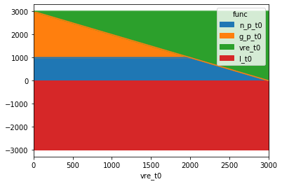
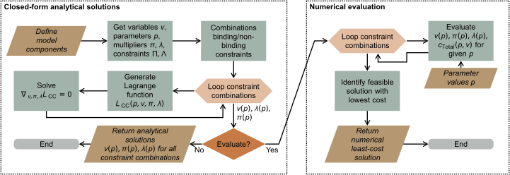
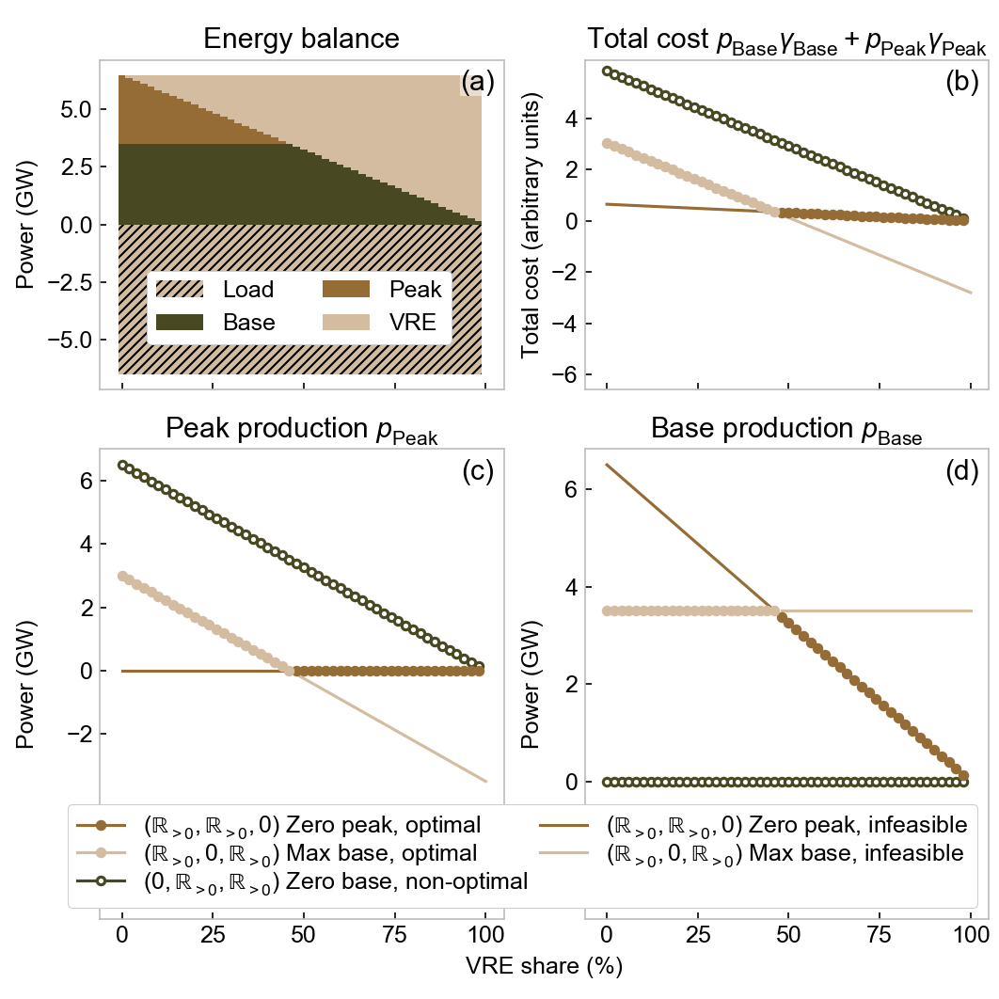

.. symenergy documentation master file, created by

   sphinx-quickstart on Sun Feb 17 09:54:31 2019.
   You can adapt this file completely to your liking, but it should at least
   contain the root `toctree` directive.

=============================
SymEnergy 
=============================

Symbolic modelling of energy systems, based on SymPy.

SymEnergy provides a framework for the structured solution of cost-optimization of energy systems using 
the standard Lagrange multiplier approach. The result consists in the close-form
analytical solutions to the optimization problem. For example, the energy production
from a power plant is expressed as
a function of the vector of symbolic parameters. These solutions are evaluated
for certain parameters in order to identify relevant constraint combinations.

============
Installation
============

``pip install symenergy``

==========
Repository
==========

`<https://github.com/mcsoini/symenergy>`_

============
Publication
============

  * \M. C. Soini *et al.*, Does bulk electricity storage assist wind and solar in replacing dispatchable power production?, Energy Economics, `<https://doi.org/10.1016/j.eneco.2019.104495>`_. 

===============
Content
===============

* :ref:`label_example_minimal`
* :ref:`label_theory_solution`
* :ref:`label_theory_components` 
* :ref:`label_theory_minimal`

.. toctree::
   :name: Table of Contents
   :maxdepth: 3

   example_constant
   doc_core_model
   doc_evaluator_plotting

.. _label_example_minimal:

===============
Minimal example
===============

Investigate the dispatch of two power plants 
during a single time slot in dependence on decreasing residual load 
(increasing variable renewable energy production).

Initialize a SymEnergy model instance:

::

    from symenergy.core import model
    m = model.Model()

Add a time slot ``'t0'`` with 3000 load and 1 VRE production. VRE production 
is varied later; any finite value of this parameter is acceptable at this point to initialize the parameter.

::

    m.add_slot('t0', load=3000, vre=1)

Add two power plants: Cheap baseload power ``'n'`` with limited capacity, expensive peaker plants ``'g'`` with unconstrained power production:

::

    m.add_plant('n', vc0=1, capacity=1000)
    m.add_plant('g', vc0=2)

All Lagrange problems corresponding to this model are generated and solved.

::

    m.generate_solve()

All results of this process are stored in the model attribute ``df_comb``, indexed by the *constraint combinations* (see below). The table below shows a single line of this table. It corresponds to the case where 

* the baseload plant is not producing power output (its positivity constraint is binding ``True``). 
* the baseload plant power production is not capacity-constrained (capacity constraint not binding ``False``) 
* the peaker plant output is not zero (non-binding positivity constraint ``False``)

::
    
    m.df_comb.iloc[[0]].T 

    ===================  ==================================================================================================================================================
    act_lb_n_pos_p_t0    True
    act_lb_n_p_cap_C_t0  False
    act_lb_g_pos_p_t0    False
    lagrange             g_p_t0*vc0_g_none*w_none + lb_n_pos_p_t0*n_p_t0 + n_p_t0*vc0_n_none*w_none + pi_supply_t0*w_none*(-g_p_t0 + l_t0 - n_p_t0 - vre_scale_none*vre_t0)
    variabs_multips      [g_p_t0, lb_n_pos_p_t0, n_p_t0, pi_supply_t0]
    result               (-(-l_t0*w_none + vre_scale_none*vre_t0*w_none)/w_none, -(-vc0_g_none*w_none**2 + vc0_n_none*w_none**2)/w_none, 0, vc0_g_none)
    tc                   -vc0_g_none*(-l_t0*w_none + vre_scale_none*vre_t0*w_none)
    ===================  ==================================================================================================================================================

The ``lagrange`` value in the table above  corresponds to the Lagrange function constructed for this combination of active and inactive constraints. It is equal to the total cost (``g_p_t0*vc0_g_none*w_none + n_p_t0*vc0_n_none*w_none``), the equality constraint (energy balance/supply constraint ``-g_p_t0 + l_t0 - n_p_t0 - vre_scale_none*vre_t0`` with multiplier (shadow price) ``pi_supply_t0``), plus the only  binding constraint with the corresponding multiplier ``lb_n_pos_p_t0*n_p_t0``.

The ``variabs_multips`` are a list of all symbols/variables for which the problem was solved. In this case, these are the peaker plant power output ``g_p_t0``, the shadow price of the baseload power posivity constraint (``lb_n_pos_p_t0``), the baseload power production ``n_p_t0``, and the shadow price of the supply constraint (the "electricity price") ``pi_supply_t0``. The result column contains a list of the same variables and multipliers. Not surprisingly, the solution (not fully simplified) of the peaker power production is equal to the residual load ``l_t0 - vre_scale_none*vre_t0``; the electricity price is equal to the variable cost of peaker power production ``vc0_g_none``. The column ``tc`` is the total cost, generated by substituting the variable solutions into the total cost expression.

The SymEnergy evaluator calculates numerical results from the closed-form solutions for certain parameter values. This allows the identify the relevant constraint combinations. In the example below the model is evaluated for increasing VRE production: The value of the parameter ``vre`` of the time slot ``'t0'`` is varied in 31 steps between 0 and 3000 (residual load 0). 

::
    
    from symenergy.evaluator import evaluator
    import numpy as np

    x_vals_vre = {m.slots['t0'].vre: np.linspace(0, 3000, 31)}
    ev = evaluator.Evaluator(m, x_vals=x_vals_vre)
    ev.get_evaluated_lambdas_parallel()
    ev.expand_to_x_vals_parallel()

The final results are stored in the attribute ``ev.df_exp``. The dataframe ``ev.df_bal`` is a convenient way of accessing the optimal solution's energy balance:

::

    (ev.df_bal.query('slot not in ["global"]')
       .pivot_table(index='vre_t0', columns='func',
                       values='lambd')[['n_p_t0', 'g_p_t0', 'vre_t0', 'l_t0']].plot.area())

The optimal solution thus corresponds to the case where the cheap baseload power plant produces power at maximum output, while the peaker plants cover the remaining residual load. Once the VRE production is large enough to fully replace the peaker plants, the production from baseload plants is reduced.

Additional analyses can be performed using the ``ev.df_exp`` table, which contains all evaluated variables. For example, we can identify for which ranges of the varied parameter ``vre_t0`` the individual constraint combinations are active:

::

    (ev.df_exp.query('is_optimum and func == "tc"')
            .groupby(['idx'] + m.constrs_cols_neq)
            .vre_t0.apply(lambda x: (x.min(), x.max()))
            .reset_index())

=====  ===================  =====================  ===================  ================
  idx  act_lb_n_pos_p_t0    act_lb_n_p_cap_C_t0    act_lb_g_pos_p_t0    vre_t0
=====  ===================  =====================  ===================  ================
    1  True                 False                  False                (3000.0, 3000.0)
    3  False                True                   False                (0.0, 2000.0)
    4  False                False                  True                 (2100.0, 2900.0)
=====  ===================  =====================  ===================  ================

.. seealso::
   
   Section :ref:`label_theory_minimal`
      Theoretical description of the minimal example's solution process

.. _label_theory_solution:

===============================================
Theoretical description of the solution process
===============================================

The figure below provides an overview of the solution process: 

* The model components are defined (time slots, power plants, storage, ...)
* The optimal operation of these components (power production, charging, capacity
  retirements) is limited by certain constraints (power capacity of power plants
  and storage, energy capacity of storage, energy balance constraint for the whole system, etc.).
* Some of these constraints are equality constraints (e.g. energy balance, must hold in all cases);
  others are inequality constraints (e.g. capacity constraints: a power plant can produce power 
  at the capacity limit, but it can possibly operate at lower output).
* **Any solution to the optimization problem will hold for a specific combination of binding and 
  non-binding inequality constraints.** For example, two constraint
  combinations might be differ by the capacity constraint of a single power plant being binding or
  non-binding, all things equal. 
* Following the standard Lagrange approach, the Lagrange function can be defined for each of these constraint combinations :math:`\mathrm{CC}`

  .. math::

      \mathcal{L} = \mathrm{CC}(\mathbf{p}, \mathbf{v}, \mathbf{\pi}, \mathbf{\lambda}) = c_\mathrm{Total}(\mathbf{p},\mathbf{v}) + \sum_i \pi_i \Pi_i(\mathbf{p}, \mathbf{v}) + \sum_j \lambda_{j} \Lambda_{j,\mathrm{CC}}(\mathbf{p}, \mathbf{v})

  with the inequality constraint  :math:`\Lambda_{j,\mathrm{CC}}(\mathbf{p}, \mathbf{v})`, the equality constraints :math:`\Pi_i(\mathbf{p}, \mathbf{v})`, and the total system cost  :math:`c_\mathrm{Total}(\mathbf{p},\mathbf{v})`. :math:`\mathbf{v}` and :math:`\mathbf{p}` are the vectors of all variables and parameters, respectively. 

* Due to the linear power plant cost (see :ref:`label_theory_components_plants`), the total cost function :math:`c_\mathrm{Total}` is quadratic. Therefore, the Karush-Kuhn-Tucker (KKT) conditions :math:`\nabla_{\mathbf{v},\mathbf{\pi},\mathbf{\lambda}}\mathcal{L}_\mathrm{CC} = 0` form a system of linear equations, whose closed-form analytical solutions :math:`\mathrm{v}(\mathbf{p})`, :math:`\mathrm{\pi}(\mathbf{p})`, and :math:`\mathbf{\lambda}(\mathbf{p})` can be calculated using the corresponding SymPy function.

.. _label_theory_components:

Components and their constraints and costs
==========================================

Time slots
----------

Time slots :math:`t` are characterized by parameters representing the demand level :math:`\Phi_{\mathrm{Load},t}` and the VRE production :math:`\Phi_{\mathrm{VRE},t}`. Optionally, a power variable :math:`p_{\mathrm{Curt},t}` allows for surplus production. These variables must be greater than zero, i.e. they are subject to positivity constraints\footnote{Equality constraint expressions are denoted by :math:`\Pi`, inequality constraint expressions are represented by the symbol :math:`\Lambda`.} :math:`\Lambda_{\mathrm{pos}, p_{\mathrm{Curt},t}}\geqslant 0` with :math:`\Lambda_{\mathrm{pos}, p_{\mathrm{Curt},t}} = p_{\mathrm{Curt},t}`.

.. _label_theory_components_plants:

Power plants
------------

Power plants pp produce electric power (variable :math:`p_{\mathrm{pp},t}`) at a linear specific variable cost :math:`c_{\mathrm{v},t} = \gamma_\mathrm{v,0,pp} + \gamma_\mathrm{v,1,pp}\cdot p_{\mathrm{pp},t}` with parameters :math:`\gamma_\mathrm{v,0,pp}` and :math:`\gamma_\mathrm{v,1,pp}` (compare section \ref{sect_method_dispatch}). Optional parameters are fixed O\&M costs :math:`\gamma_\mathrm{f,pp}` (EUR/MW) and installed capacities :math:`\Gamma_\mathrm{pp}` (MW). The optional retired capacity variable :math:`C_\mathrm{pp,ret}` (MW) is subject to optimization. The total cost associated with power plant operation is thus

.. math::

   c_\mathrm{Total} = \sum_{\mathrm{pp}, t}\big[ 
        & p_{\mathrm{pp},t}\left( \gamma_\mathrm{v,0,pp} + 0.5\cdot \gamma_\mathrm{v,1,pp} \cdot p_{\mathrm{pp},t} \right) \\ 
   & + \gamma_\mathrm{f,pp} \left(\Gamma_\mathrm{pp} - C_\mathrm{pp,ret}\right) \big].
	\label{equ_total_cost}

The feasible solution space of the power plant variables is reduced by the capacity constraints :math:`\Lambda_{\mathrm{cap},p_{\mathrm{pp},t}} = \left(\Gamma_\mathrm{pp} - C_\mathrm{pp,ret}\right) - p_{\mathrm{pp},t}\geqslant 0` and :math:`\Lambda_{\mathrm{cap},C_\mathrm{pp,ret}} = \Gamma_\mathrm{pp} - C_\mathrm{pp,ret}\geqslant 0`, as well as the positivity constraints :math:`\Lambda_{\mathrm{pos},p_{\mathrm{pp},t}} = p_{\mathrm{pp},t} \geqslant 0` and :math:`\Lambda_{\mathrm{pos},C_\mathrm{pp,ret}} = C_\mathrm{pp,ret} \geqslant 0`.

.. _label_theory_components_storage:

Storage
-------

Storage assets *s* charge and discharge with power :math:`p_{\mathrm{chg/dch,s},t}`. The round-trip efficiency is :math:`\eta`. Optionally, the subsets of time slots during which the storage is charging and/or discharging can be selected. This allows for model simplifications. The internal structure of the storage representation depends on the amount of simplification:

* Strong simplification: Assume a two time slot system with :math:`\mathcal{H}={t_0, t_1}`. If the charging and discharging slots are defined in such a way that the two corresponding slot subsets are disjoint :math:`\mathcal{H}_\mathrm{chg}\left\{t_0\right\}`, :math:`\mathcal{H}_\mathrm{dch}\left\{t_1\right\}`, the maximum stored energy :math:`e_\mathrm{s}` is a time-independent variable. In this case, energy conservation is enforced through the charging-discharging equality constraint :math:`\Pi_{\mathrm{cd,s}} = \sum_t p_{\mathrm{chg,s},t} \eta_\mathrm{s} - \sum_\mathrm{t} p_{\mathrm{dch,s},t} = 0` (round-trip efficiency :math:`\eta_\mathrm{s}`); the charged energy follows from :math:`\Pi_\mathrm{e,s} = \sum_t p_{\mathrm{chg,s},t}\eta_\mathrm{s}^{1/2} - e_\mathrm{s} = 0`.

* Weak simplification: For the same set of time slots, if charging-discharging sets overlap (e.g.  :math:`\mathcal{H}_\mathrm{chg}=\left\{t_0\right\}`, :math:`\mathcal{H}_\mathrm{dch}=\left\{t_1\right\}`), or no specifications are made, the  stored energy :math:`e_{t, \mathrm{s}}` is time-dependent. In this case, the stored energy is defined through the equality-constraint :math:`e_t = e_{t-1} - \eta^{-1/2} p_{\mathrm{dch,t} + \eta^{1/2} p_{\mathrm{chg},t}`.

All variables are subject to positivity constraints and optional capacity constraints (power capacity :math:`\Gamma_\mathrm{s}` and energy capacity :math:`\Sigma_\mathrm{s}`), analogous to the power plant variables.

Model constraints
-----------------

For each :math:`t`, the demand equality constraint is defined as 

.. math::
    
    \Pi_{\mathrm{d},t} = \Phi_{\mathrm{Load},t} + p_{\mathrm{Curt},t} + \sum_\mathrm{s}p_{\mathrm{chg,s},t} - \Phi_{\mathrm{VRE},t} - \sum_\mathrm{s}p_{\mathrm{dch,s},t} - \sum_\mathrm{pp}p_{\mathrm{pp}, t} = 0.
   
This describes the energy balance, i.e. all power consumption (load, curtailment, charging) must equal all power production (power plant production, storage discharging). 

.. seealso::

    :ref:`sect_comps`
      API documentation on adding components to a model instance

.. _label_theory_minimal:

Theoretical discussion of the minimal example
=============================================

The theoretical background of the basic example in section :ref:`label_example_minimal` is further explained. This example allows to demonstrate the optimization using  SymEnergy. The considered system is simple enough for its optimal solution to be intuitively accessible. Energy is supplied during a single time slot (load parameter :math:`\Phi_\mathrm{Load}`, VRE production parameter :math:`\Phi_\mathrm{VRE}`) by cheap baseload power and expensive peaker plants:

* Base plant production :math:`p_\mathrm{Base}` (specific variable cost :math:`\gamma_\mathrm{Base}`) must be positive (constraint :math:`\Lambda_{\mathrm{pos},p_{\mathrm{Base}}}\geqslant 0`, multiplier :math:`\lambda_{\mathrm{pos},p_{\mathrm{Base}}}`); it is constrained by the base capacity :math:`\Gamma_\mathrm{Base}` (:math:`\Lambda_{\mathrm{cap},p_{\mathrm{Base}}}\geqslant 0` with multiplier :math:`\lambda_{\mathrm{cap},p_\mathrm{Base}}`).
* Peaker plant production :math:`p_\mathrm{Peak}` (specific variable cost :math:`\gamma_\mathrm{Peak} > \gamma_\mathrm{Base}`) must be positive (:math:`\Lambda_{\mathrm{pos},p_{\mathrm{Peak}}}\geqslant 0`, multiplier :math:`\lambda_{\mathrm{pos},p_{\mathrm{Peak}}}`) and is otherwise unconstrained.

The total cost is :math:`p_\mathrm{Base}\gamma_\mathrm{Base} + p_\mathrm{Peak}\gamma_\mathrm{Peak}`, the demand constraint is :math:`\Pi_{\mathrm{d}}= \Phi_\mathrm{Load}-p_\mathrm{Base}-p_\mathrm{Peak} - \Phi_\mathrm{VRE}  = 0` with multiplier :math:`\pi_\mathrm{d}`. 

Without further analysis, the optimal solution can be expected to correspond to the case where :math:`p_\mathrm{Base}` covers a maximum of the residual load :math:`\Phi_\mathrm{Load} - \Phi_\mathrm{VRE}`, with :math:`p_\mathrm{Peak}` supplying the rest. This is shown in panel (a) of the figure above as a function of the VRE share. SymEnergy starts from the 3 binding or non-binding inequality constraints. Consequently, the total number of potential general solutions (constraint combinations) is :math:`2^3=8`:

* Two of these constraint combinations---:math:`(\Lambda_{\mathrm{pos},p_{\mathrm{Base}}},\Lambda_{\mathrm{cap},p_{\mathrm{Base}}},\Lambda_{\mathrm{pos},p_{\mathrm{Peak}}})\in  \left\{\left(0,0,\mathbb{R}_{\neq0}\right),\left(0,0,0\right)\right\}`---correspond to the case where baseload power production is simultaneously zero and equal its installed power capacity. They can be excluded a priori, without loss of generality.
* Three of the remaining constraints would be valid only for specific parameter value combinations. For example, all constraint combinations with zero peak production and binding baseload capacity constraint (:math:`\Lambda_{\mathrm{pos},p_{\mathrm{Peak}}}=\Lambda_{\mathrm{cap},p_{\mathrm{Base}}}=0`), would require the baseload capacity parameter to be exactly equal the residual load parameter: :math:`\Gamma_\mathrm{Base} \equiv \Phi_\mathrm{Load} - \Phi_\mathrm{VRE}`. Therefore, no general solution exists.
* The remaining three combinations

.. math::

    (\Lambda_{\mathrm{pos},p_{\mathrm{Base}}},
     \Lambda_{\mathrm{cap},p_{\mathrm{Base}}},
     \Lambda_{\mathrm{pos},p_{\mathrm{Peak}}}) \in \{
   &(\mathbb{R}_{\neq0},\mathbb{R}_{\neq0},0),\\
   &(\mathbb{R}_{\neq0},0,\mathbb{R}_{\neq0}),\\
   &(0,\mathbb{R}_{\neq0},\mathbb{R}_{\neq0})\}

are potentially optimal solutions, depending on the parameter values.

For illustration, the solution for the constraint combination :math:`(\mathbb{R}_{\neq0},0,\mathbb{R}_{\neq0})` is calculated. It implies a binding base capacity constraint (:math:`\Lambda_{\mathrm{cap},p_\mathrm{Base}} = \Gamma_\mathrm{Base} - p_\mathrm{Base} = 0`) and both plants producing positive power output (:math:`\Lambda_{\mathrm{pos},p_\mathrm{Base}} = p_\mathrm{Base} > 0`, :math:`\Lambda_{\mathrm{pos},p_\mathrm{Peak}} = p_\mathrm{Peak} > 0`). The resulting Lagrange function is

.. math::

    \mathcal{L}_{(\mathbb{R}_{\neq0},0,\mathbb{R}_{\neq0})} & = p_\mathrm{Base}\gamma_\mathrm{Base} + p_\mathrm{Peak}\gamma_\mathrm{Peak} \\
       &+ \lambda_{\mathrm{cap},p_\mathrm{Base}}\Lambda_{\mathrm{cap},p_\mathrm{Base}}+ \pi_\mathrm{d}\Pi_\mathrm{d}

The KKT conditions :math:`\nabla_{\mathbf{v},\mathbf{\pi},\mathbf{\lambda}}\mathcal{L}_{(\mathbb{R}_{\neq0},0,\mathbb{R}_{\neq0})}(\mathbf{p},\mathbf{v},\mathbf{\pi},\mathbf{\lambda})=0` with respect to all variables and multipliers yield a system of linear equations:

.. math::

    \left[\begin{matrix}
              0 & 0 & 1 & 1\\
              0 & 0 & 1 & 0\\
              1 & 0 & 0 & 0\\
              1 & 1 & 0 & 0
              \end{matrix}\right] 
    \cdot 
    \left[\begin{matrix}
	p_\mathrm{Base} \\ 
	p_\mathrm{Peak} \\
	\pi_\mathrm{d} \\ 
	\lambda_{\mathrm{cap},p_\mathrm{Base}} \\ 
     \end{matrix}\right]
     = 
     \left[\begin{matrix}
     	\gamma_\mathrm{Base}\\
     	\gamma_\mathrm{Peak}\\
     	\Gamma_\mathrm{Base}\\
     	\Phi_\mathrm{Load} - \Phi_\mathrm{VRE} \\
     \end{matrix}\right].

Its closed-form analytical solution :math:`p_\mathrm{Base} = \Gamma_\mathrm{Base}`, :math:`p_\mathrm{Peak} = \Phi_\mathrm{Load} - \Phi_\mathrm{VRE} - \Gamma_\mathrm{Base}`, :math:`\pi_\mathrm{d} =\gamma_\mathrm{Peak}`, :math:`\lambda_{\mathrm{cap},p_\mathrm{Base}} = \gamma_\mathrm{Base} - \gamma_\mathrm{Peak}` corresponds to the case where the baseload plants are operating at the capacity limit, and the peaker plant is used to cover the remaining residual load. With the respective definitions of the other Lagrange functions :math:`\mathcal{L_\mathrm{CC}}`, the general solutions for the remaining constraint combinations above are found analogously.

In the figure above, b-d, the solutions of all constraint combinations are evaluated for 51 discrete VRE production values from 0 to :math:`\Phi_\mathrm{Load}`.

* **Optimal:** By definition, the optimal solution for each set of parameter values is determined by the feasible solution with the lowest total cost (panel b). For low VRE shares, this implies maximum baseload operation---:math:`(\mathbb{R}_{\neq0},0, \mathbb{R}_{\neq0})`; meanwhile, peak plants cover the remaining power demand. For higher VRE shares, the residual demand is smaller than the base capacity, such that the output from the latter gradually decreases; in this case, the peak output is zero and the base plant is not capacity constrained---:math:`(\mathbb{R}_{\neq0},\mathbb{R}_{\neq0},0)`.
* **Non-optimal:** Another  feasible solution exists for all VRE shares---:math:`(0, \mathbb{R}_{\neq0},\mathbb{R}_{\neq0})`: It corresponds to the base plant delivering zero output and all demand being covered by the peaker plants (panel c). The higher variable cost of the latter makes this option prohibitively expensive in all cases.
* **Infeasible:** Finally, the constraint combinations comprising the optimal solutions can also be infeasible, depending on the VRE share: At high VRE shares, this is the case if the base plants produce at full power output and peaker plants produce negative output to compensate for the overproduction. At low VRE shares, base plant capacity violations are equally cost-effective yet infeasible. For any given parameter set, these infeasible solutions must be identified by evaluating all of the model's constraints.

.. seealso::

    :ref:`label_example_minimal`
      Description of the implementation of this example in SymEnergy

    :ref:`label_theory_components`
      Discussion of model component properties

    `<https://doi.org/10.1016/j.eneco.2019.104495>`_
       This example is included in the publication *Does bulk electricity storage assist wind and solar in replacing dispatchable power production?*, Energy Economics, Volume **85**, January 2020, 104495

Indices and tables
==================

* :ref:`genindex`
* :ref:`modindex`
* :ref:`search`
